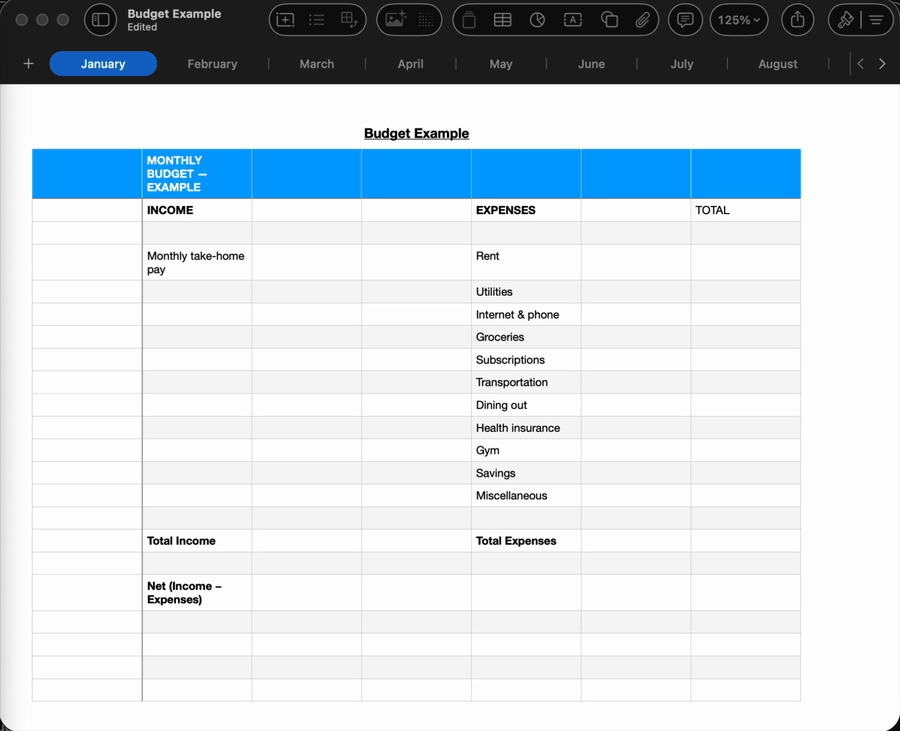

# Digits — connect Claude to Apple Numbers



Talk to your spreadsheets. Digits is a **zero-dependency** MCP server that
lets Claude read and edit live Apple Numbers documents — cells, formulas,
rows, sheets — packaged as a Claude plugin with bundled **budget-review**,
**monthly-report**, and **data-cleanup** skills.

No pip. No uv. No node. One Python file, standard library only. If your Mac
can run `python3`, you can install Digits in under a minute.

## What it feels like

> **You:** review my budget
> **Claude:** *reads your open Budget spreadsheet* — "Rent, utilities and
> insurance are filled in. Groceries, subscriptions and gym are blank, and
> your Total row is a typed number, not a formula. Want me to fix that?"
> **You:** groceries 400, gym 45, subs 60
> **Claude:** *writes all amounts + live `=SUM()` totals in one batch* —
> undoable with Cmd+Z, saved only when you say so.

## Why AppleScript instead of parsing .numbers files?

- **Live documents.** Edits appear instantly in the open window, are
  undoable with Cmd+Z, and nothing touches disk until you save.
- **Real formula results.** Reading a formula cell returns what Numbers
  actually computed — no reimplementing the formula engine.
- **Zero file-format risk.** No reverse-engineered parser to break when
  Apple changes the format.

The trade-off: macOS only, and Numbers must be installed. (That's the
point.)

## Tools

| Tool | What it does |
|---|---|
| `numbers_list_documents` | Names of open spreadsheets |
| `numbers_open_document` | Open a `.numbers` file by path |
| `numbers_list_sheets` | Sheet tabs in a document |
| `numbers_list_tables` | Tables on a sheet, with dimensions |
| `numbers_read_table` | Full table as a 2D grid, optionally with formulas |
| `numbers_set_cells` | Batch-write values and formulas (`"=SUM(F4:F14)"`) |
| `numbers_add_row` / `numbers_add_column` | Append rows/columns |
| `numbers_save_document` | Save to disk (edits are in-memory until then) |
| `numbers_create_document` | New blank spreadsheet from nothing |
| `numbers_import_csv` | CSV file or raw text → new Numbers document, parsed natively |
| `numbers_export_csv` | Any table → CSV text or file |
| `numbers_health_check` | Diagnose setup: Numbers present, automation permission, etc. |
| `numbers_add_sheet` / `numbers_rename_sheet` / `numbers_delete_sheet` | Manage sheets (tabs) |
| `numbers_insert_row` / `numbers_delete_row` | Insert/delete rows at an index |
| `numbers_insert_column` / `numbers_delete_column` | Insert/delete columns at an index |
| `numbers_export` | Export the document as PDF, Excel (.xlsx), or CSV |
| `numbers_save_as` | Save to a specific .numbers path |

All tools default to the front document / active sheet / first table, so
they work on whatever is on screen without ceremony.

### Tool reference

Every tool advertises a full JSON Schema over MCP (`tools/list`), so any
client shows you the parameters. They're documented in full below for quick
reference. Conventions shared by most tools:

- `document` — document name; **defaults to the front document**.
- `sheet` — sheet (tab) name; **defaults to the active sheet**.
- `table` — table name; **defaults to the first table** on the sheet.

Row and column indices are **1-based** (row 1 is the first row), matching how
Numbers itself counts.

<details>
<summary><b>Discovery & reading</b></summary>

**`numbers_list_documents`** — no parameters. Returns the names of all open
spreadsheets. Launches Numbers if needed.

**`numbers_open_document`** — `path` *(required, string)*: absolute POSIX path
to a `.numbers` file. Returns the opened document's name.

**`numbers_list_sheets`** — `document`. Returns the sheet (tab) names.

**`numbers_list_tables`** — `document`, `sheet`. Returns
`[{name, rows, columns}]` for each table on the sheet.

**`numbers_read_table`** — `document`, `sheet`, `table`,
`include_formulas` *(boolean, default `false`)*, `max_rows`
*(integer 1–2000, default 200)*. Returns
`{rows: [[...]], row_count: N}`; empty cells are `null`, numbers come back as
numbers. With `include_formulas: true` it also returns a parallel `formulas`
grid (`null` where a cell has no formula).

```jsonc
// numbers_read_table
{ "include_formulas": true, "max_rows": 50 }
// → { "rows": [["Item","Amount"],["Rent",1200]],
//     "formulas": [[null,null],[null,null]], "row_count": 2 }
```
</details>

<details>
<summary><b>Writing cells, rows & columns</b></summary>

**`numbers_set_cells`** — `updates` *(required, array of 1–200
`{cell, value}`)*, plus `document`/`sheet`/`table`. `cell` is an A1-style
address (`"F7"`); `value` is a string, number, or boolean. A string beginning
with `=` is entered as a **formula**. All updates apply in one AppleScript
round-trip (see [Performance & atomicity](#performance--atomicity)).

```jsonc
// numbers_set_cells
{ "updates": [
    { "cell": "B2", "value": 400 },
    { "cell": "B3", "value": 45 },
    { "cell": "B10", "value": "=SUM(B2:B9)" }
] }
```

**`numbers_add_row`** / **`numbers_add_column`** — `count`
*(default 1; rows 1–100, columns 1–26)*, plus target. Appends at the end.

**`numbers_insert_row`** — `after_row` *(required, integer)*, `count`
*(1–100, default 1)*, plus target. Inserts blank rows after the given index.

**`numbers_delete_row`** — `row` *(required, integer)*, `count`
*(1–100, default 1)*, plus target. Deletes starting at `row`. To delete
several scattered rows, delete from the **bottom up** so indices don't shift.

**`numbers_insert_column`** — `after_column` *(required)*, `count`
*(1–26, default 1)*, plus target.

**`numbers_delete_column`** — `column` *(required)*, `count`
*(1–26, default 1)*, plus target.
</details>

<details>
<summary><b>Documents, sheets, CSV & export</b></summary>

**`numbers_create_document`** — no parameters. New blank spreadsheet (one
sheet, one table). Unsaved until you save it.

**`numbers_import_csv`** — exactly one of `path` *(string)* or `csv_text`
*(string)*. Numbers parses the CSV natively (quoting, embedded commas, type
inference). Creates a new, unsaved document.

**`numbers_export_csv`** — `document`/`sheet`/`table`, `path` *(optional)*,
`max_rows` *(1–2000, default 2000)*. Returns CSV text, or writes it to `path`
if given.

**`numbers_export`** — `path` *(required)*, `format` *(required:
`pdf` | `excel` | `csv`)*, `document`. Exports the whole document via
Numbers' native exporter.

**`numbers_add_sheet`** — `document`, `name` *(optional)*. Appends a blank
sheet (Numbers can't duplicate sheet contents — see Limitations).

**`numbers_rename_sheet`** — `name` *(required)*, `new_name` *(required)*,
`document`.

**`numbers_delete_sheet`** — `name` *(required)*, `document`. A document must
keep at least one sheet.

**`numbers_save_document`** — `document`. Saves in place (no-op path until the
user has chosen one).

**`numbers_save_as`** — `path` *(required)*, `document`. Saves to a specific
`.numbers` path.

**`numbers_health_check`** — no parameters. Returns
`{python, platform, numbers_version, automation_permission, open_documents,
status}` and a list of `issues` if anything's wrong. Run it first when a tool
misbehaves.
</details>

## Install

**As a Claude plugin (Cowork / Claude Code):** install the `.plugin` file, or
add this repo as a marketplace and install from there:

```
/plugin marketplace add apeabody007/digits
/plugin install digits@digits
```

**As a bare MCP server** (Claude Desktop or any MCP client):

```json
{
  "mcpServers": {
    "digits": {
      "command": "python3",
      "args": ["/path/to/server/digits_server.py"]
    }
  }
}
```

First run only: macOS will ask you to allow your MCP client to control
Numbers — approve it (System Settings → Privacy & Security → Automation if
you missed the prompt). If `python3` says "command line developer tools",
run `xcode-select --install` once.

### Verify your setup

The server normally speaks MCP over stdio, but you can run it by hand to
confirm the install before wiring it into a client:

```
python3 server/digits_server.py --version       # prints: digits 0.5.0
python3 server/digits_server.py --health-check   # diagnoses macOS / Numbers / permission
python3 server/digits_server.py --list-tools     # one-line summary of every tool
python3 server/digits_server.py --help
```

`--health-check` exits non-zero (and lists the problem) if you're not on
macOS, `osascript` is missing, or automation permission hasn't been granted —
the same diagnostics the `numbers_health_check` tool returns.

## Bundled skills

Skills are short playbooks that tell Claude how to drive the tools for a
recurring task. Digits ships with three:

- **budget-review** — say "review my budget" and Claude finds the budget
  document, reads the current month's sheet, flags missing amounts and
  hard-coded totals, collects numbers conversationally, writes everything back
  in one batch with live formulas, and asks before saving.
- **monthly-report** — "summarize this month" / "roll this up by category":
  Claude reads your raw rows, computes per-category totals and
  month-over-month deltas, writes the summary to its own sheet with live
  formulas, and can export it to PDF or Excel.
- **data-cleanup** — "clean up this data" / "find duplicates" / "why won't
  this column sum": Claude profiles the table for duplicates, blanks,
  inconsistent labels, and text stuck in number columns, proposes a fix plan,
  and — once you approve — applies it safely (value fixes batched, row
  deletions bottom-up).

## Implementation notes

- **Zero dependencies**: `server/digits_server.py` implements MCP's JSON-RPC
  stdio protocol directly in a single stdlib-only Python file. Nothing to
  install, nothing to break.
- Table serialization uses ASCII unit/record separators (0x1F/0x1E) between
  cells/rows, so commas, quotes, and newlines inside cells can never corrupt
  parsing.
- Strings starting with `=` are entered as formulas — same convention as
  typing into Numbers.
- Errors are mapped to actionable messages (automation permission missing,
  bad sheet/table name, modal dialog blocking AppleScript).

### Performance & atomicity

Each tool call shells out to a fresh `osascript` process. That's a deliberate
trade: a brand-new subprocess every time means no shared state to leak, no
long-lived AppleScript bridge to wedge, and no cleanup to get wrong — the
property that keeps the "one file, nothing to break" promise honest. The cost
is a few tens of milliseconds of process spin-up per call, which is invisible
at conversational speed. (A persistent `osascript` session would shave that
off but trade away the robustness; it isn't worth it here.)

There are **no transactions**. AppleScript has no rollback, so if you need
several edits to land together, put them in a **single `numbers_set_cells`
call** — the whole batch is sent as one script and applied in order, which is
as close to atomic as the platform allows and far better than dribbling cells
in one call at a time. Everything stays in memory and undoable with Cmd+Z
until you explicitly save, so a half-finished session is never written to
disk.

## Limitations / roadmap

These are honest boundaries of what Numbers exposes to AppleScript, with the
workaround we'd reach for today:

- **No cell formatting** (currency styles, fills, colors, fonts). Numbers'
  AppleScript dictionary barely exposes styling.
  *Workaround:* keep values unformatted and apply a cell format once by hand —
  Numbers keeps it when Digits overwrites the value. A scripted path via
  System Events UI scripting is the planned direction but isn't shipped.
- **Sheet duplication and reordering are not possible** — Numbers' scripting
  refuses to copy a sheet (error -1717) or `move` a sheet (error -10000). New
  sheets via `numbers_add_sheet` start blank and append at the end.
  *Workaround:* duplicate or drag-reorder the tab manually in Numbers, then
  let Digits fill it; or build the new sheet's structure from scratch with
  `numbers_set_cells`.
- **No chart creation.**
  *Workaround:* insert a chart once in Numbers bound to a data range; Digits
  edits to that range update the chart live.
- **No transactions / rollback.** Batch related edits into one
  `numbers_set_cells` call (see [Performance & atomicity](#performance--atomicity)),
  and rely on Cmd+Z / not-yet-saved as the safety net.
- **A modal dialog blocks AppleScript.** If Numbers is showing a save sheet or
  alert, calls time out; dismiss it and retry. `numbers_health_check`
  surfaces this.
- Tested on Numbers 15.x / macOS 15.

## Development

No build step and no dependencies. The test suite mocks the AppleScript
bridge, so it runs anywhere (including non-macOS CI) without Numbers:

```
python3 -m unittest discover -s tests   # stdlib only, no pip needed
# or, if you have pytest:
pytest tests/
```

The tests cover the helper functions, AppleScript generation, table parsing,
argument validation, error mapping, and the MCP JSON-RPC surface — by
swapping `digits_server._run` for a fake that records the script it was handed
and returns canned output.

## License

MIT
